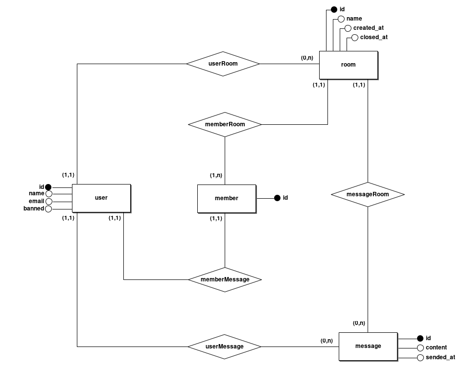
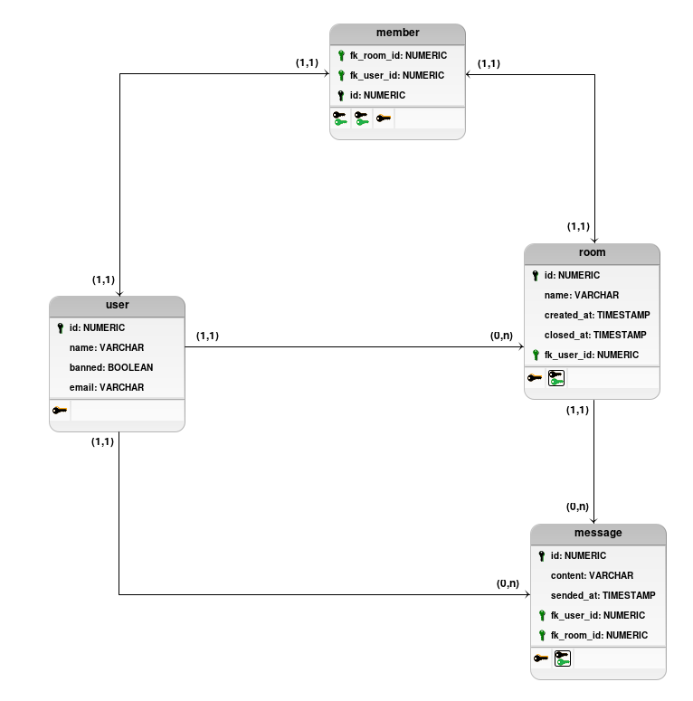

<h1>BD2 Project: Web Chat Room Based Application</h1>

<table>
  <tr>
    <td><strong>Título</strong></td>
    <td>Web Chat Room Based Application</td>
  </tr>
  <tr>
    <td><strong>Descrição</strong></td>
    <td>
      Simples aplicação de Web Chat em tempo real baseado em salas. O sistema contará com UserAuthLess e utilizando
      triggers, procedure e <em>pg_notify </em>para encaminhar novas mensagens a sala. Deste modo, utilizando Event
      Listeners será possível sincronizar as mensagens entre todos os usuários da sala.
    </td>
  </tr>
  <tr>
    <td><strong>Membros</strong></td>
    <td>
      <ul>
        <li>Ana Paula Teixeira</li>
        <li>Jaine De Senna Santos</li>
        <li>Marcelo Victor Melo Nunes</li>
        <li>Maria Das Graças Dias Amorim</li>
        <li>Zaú Júlio Araújo Galvão</li>
      </ul>
    </td>
  </tr>
  <tr>
    <td><strong>SGBD</strong></td>
    <td>PostgreSQL</td>
  </tr>
  <tr>
    <td><strong>Instalação do Ambiente</strong></td>
    <td>
      <a href="https://github.com/ZauJulio/DBMSWithPortainer">Docker&Postgres - Tutorial</a>
    </td>
  </tr>
</table>

# 1. Descrição Prática

## 1.1 Modelo entidade-relacionamento

Ex.: **table**(_pk_, attr, attr, **_fk_**);

- **user**(_id_, name, email, banned);
- **room**(_id_, name, created\*at, \*\*\_closed*at**\*, **\_created_by*\*\*);
- **message**(_id_, content, sended\*at, \*\*\_userId**\*, **_roomId_\*\*);
- **member**(_id_, **_userId_**, **_roomId_**);

## 1.2 conceitual

## 1.3 Lógico

